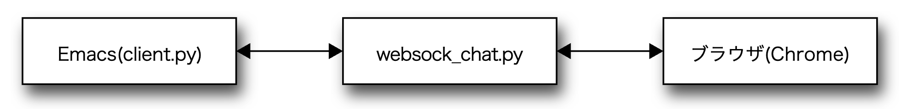

## LispASS - Lisp As Syntax Sugar for javascript

WEBアプリの開発を「lispのREPLでできたらいいなぁ」という発想で作ってみました.
ブラウザ上で動いているlispが、websock経由で送り込まれた
S式を評価します. 結果もwebsock経由で返します.

インタープリタは、EY-Officeの吉田裕美さんの「ちょっと変わったLisp入門」をベースにしています.

### なにができるか

#### REPLが使える

websockのサーバになる簡単なプログラム(websock_chat.py)とEmacs側のクライアントプログラム(client.py)を
使って、Emacsの\*inferior-lisp\*モードからプログラムが書けます. 

ブラウザでHTML画面を表示しておいて、結果を確認しつつEmacsでコードを書き足すような、
インターアクティブなことができます.



websock_chat.py経由ではありますが、Emacsから外部リスプを起動しているような立て付けになります.

ポート番号は**5003**で、変更する場合はconfig.js, websock_chat.py, client.pyの冒頭部分を直します.

#### lispでイベントハンドラが書ける

例えばHTMLにこんなボタンがある場合、

```
<button type="button" name="new" class="btn btn-sm btn-primary">新規</button>
```

lispの関数でclickイベントハンドラを書くと以下のようになります.

```
(defun f (this e)
  (prln "pushed"))

(setq b ($ "button[name='new']")) ; ここではjQueryの$を使っている

(b :on "click" (wrap f))
```

その後、fの定義をREPLから変更すれば、以降は**変更後の関数**が呼び出されます.
これはシンボルfの評価をイベントハンドラの実行時に行うためです.
wrapはシンボルと環境を結びつけたオブジェクトを返すフォームです.

#### javascriptのオブジェクトを呼び出せる

javascriptのオブジェクトは関数として扱われ、プロパティにアクセスしたり、メソッドを呼び出すことができます.

```
=> ("abc" :length>)
3

=> ("abcd" :indexOf "c")
2

=> (setq a (js-eval "[]"))
[]

=> (a :push 3)
1

=> a
[3]
```

逆にjavascriptからlispの関数を呼び出すこともできます.

```
<script>
 jQuery(function() {
   _G.funcall("lisp-init"); 
 });     
</script>
```

#### マクロが使える

Emacsのe-lisp程度のマクロが使えます.
バッククオート、コンマ、コンマ@などが使えます.

```
(defmacro += (x &rest args) `(setq ,x (funcall + ,x ,@args)))
```

### 特徴

関数と変数は同じ名前空間を使います.

deep bindingでdynamicスコーピングです. ただしトップの環境とパッケージはhashです.

javascriptのスタックフレームを使います.

GCもjavascript頼みです.

テイルコール最適化していないので、再帰を深くしすぎるとコケます.

演算子は基本的にjavascriptと同じものです.

速くはないですが、最近のjavascriptの性能のおかげで、
ヒューマンインターフェース周りを書くなら(私は)問題無いように感じます.

### 使い方

ブラウザで動くlispとUIであるEmacs上のサブプロセス(client.py)が通信するのですが、
その間をwebsockサーバ(websock_chat.py)が取り持つ形となっています.

#### websockサーバ
まずpython3でwebsockサーバである、websock_chat.pyをコマンドラインから起動します.
必要なライブラリが無ければメッセージが出るのでpipで入れてください.

```
python websock_chat.py
```

#### lispインタープリタ側(websockクライアント)

次にChromeなどのブラウザでsample.htmlを開きます.
websock_chat.pyとつながるはずです. 開発用の窓を出しておくと
色々な情報が表示されて便利です.

#### Emacsの\*inferior-lisp\*(websockクライアント)

エディタはEmacsを使うのが前提です. 設定ファイルに
```
;;; websockのlisp環境
(setq *websock* nil)

(defun websock-lisp-mode-hook ()
  (defun lisp-eval-region (start end &optional and-go)
    (interactive "r\nP")
    (comint-send-region (inferior-lisp-proc) start end)
    (comint-send-string (inferior-lisp-proc) (if *websock* "\000\n" "\n"))
    (if and-go (switch-to-lisp t)))
  )

(add-hook 'inferior-lisp-mode-hook 'websock-lisp-mode-hook)

;; (bind-keys :map lisp-mode-map 
;; 	   ("C-j" . lisp-eval-last-sexp))

```
を加えます. lispに送る**S式の最後に0を付加**する必要があるためです.

次にEmacsを起動しリスプファイルを編集します. 今回はa.lを開くこととします.
a.lのようなリスプファイルの先頭には必ず、

```
;; -*- *websock*:t; -*-
```
と書いて置く必要があります.  これにより設定ファイルに書いたフックを
有効にします.

別窓で、Ctrl-u ESC-x run-lispでリスプを起動します.
リスププログラムにはpython client.pyを指定してください.

websock_chat.pyを通じてブラウザとEmacsが噛み合えば、a.lのバッファから
lis-eval-last-sexpなどでS式が送れるようになります.
どれかのキーにバインドしておくとお手軽です.

いろいろ試しながら関数を書き、うまく動くことが分かったら、関数単位で
初期化ファイル(例えばmy.l)に移します. Makefileを見てください.


